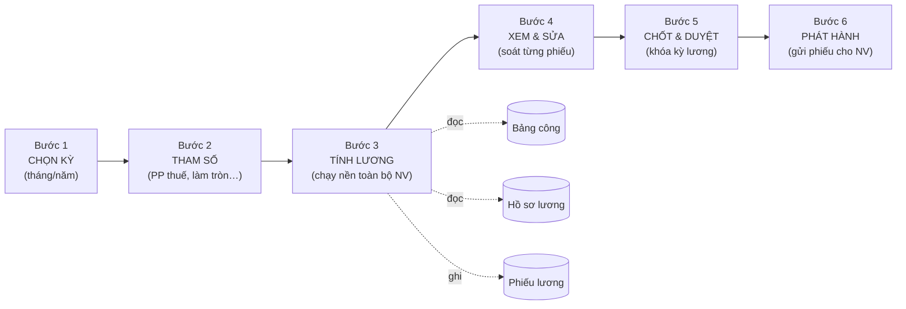

# Quy trình Tính lương HRM — Tài liệu luồng cho User & BA

> Mục đích: giúp người dùng nghiệp vụ (HR) và BA hiểu **luồng tính lương** chạy như thế nào trên giao diện, mỗi bước làm gì, dữ liệu lấy từ đâu, và hệ thống xử lý gì ở phía sau.
>
> Phạm vi: phân hệ **HR → Tiền lương → Tính lương tháng** (wizard 6 bước) + cơ sở dữ liệu lấy từ **Bảng công**.

---

## 1. Bức tranh tổng thể

Tính lương = **gộp 3 nguồn dữ liệu** lại theo công thức rồi ra **phiếu lương** từng nhân viên:

```
┌─────────────┐   ┌──────────────┐   ┌─────────────────┐
│  BẢNG CÔNG  │   │ HỒ SƠ LƯƠNG  │   │ ĐƠN BỔ SUNG/    │
│ (ngày công, │   │ (lương CB,   │   │ KHẤU TRỪ        │
│  OT, đi trễ,│ + │  phụ cấp,    │ + │ (thưởng, phạt,  │
│  ca đêm…)   │   │  KPI, BHXH)  │   │  tạm ứng…)      │
└──────┬──────┘   └──────┬───────┘   └────────┬────────┘
       │                 │                    │
       └─────────────────┼────────────────────┘
                         ▼
              ┌──────────────────────┐
              │   ĐỘNG CƠ TÍNH LƯƠNG  │  (công thức LSEV)
              └──────────┬───────────┘
                         ▼
              ┌──────────────────────┐
              │   PHIẾU LƯƠNG / NV    │  (gross, thuế, BH, thực nhận)
              └──────────────────────┘
```

**Điều kiện tiên quyết:** phải có **Bảng công tháng** đã chốt trước khi tính lương. Nếu chưa "Tính lại công" thì tính lương sẽ thiếu/sai số liệu công.

---

## 2. Sơ đồ luồng 6 bước (wizard)



---

## 3. Chi tiết từng bước

### Bước 1 — Chọn kỳ (Select Period)
| | |
|---|---|
| **Người dùng làm gì** | Chọn **tháng/năm** cần tính lương (vd 6/2026). |
| **Hệ thống làm gì** | Tạo/hoặc nạp lại "kỳ lương" (PayrollMonth) cho tháng đó. Kiểm tra kỳ đã bị **khóa** chưa. |
| **Điều kiện** | Bảng công của tháng nên đã được tổng hợp ("Tính lại công"). |

### Bước 2 — Tham số (Parameters)
| | |
|---|---|
| **Người dùng làm gì** | Chọn **phương pháp thuế TNCN** (PT1 / PT2), cách làm tròn, ghi đè (overwrite) kỳ cũ nếu tính lại. |
| **Hệ thống làm gì** | Lưu cấu hình tham số cho lần tính. |
| **Ghi chú** | **PT1** = chỉ phần OT vượt 100% được miễn thuế (mặc định, đúng luật). **PT2** = miễn thuế toàn bộ OT. |

### Bước 3 — Tính lương (Calculate) ⭐ bước lõi
| | |
|---|---|
| **Người dùng làm gì** | Bấm nút **"Bắt đầu tính lương"**. Theo dõi thanh tiến độ `x/tổng NV`. |
| **Hệ thống làm gì** | Chạy **nền (background job)** cho **toàn bộ** nhân viên: với mỗi NV → đọc bảng công + hồ sơ lương + đơn bổ sung/khấu trừ → áp công thức → **tạo/ghi đè phiếu lương**. Xong thì kỳ chuyển trạng thái **Completed**. |
| **Kết quả** | Mỗi NV có 1 phiếu lương: lương CB theo công, phụ cấp, OT, thưởng chuyên cần, KPI, ca đêm, trừ đi trễ, BHXH/YT/TN + công đoàn, thuế TNCN → **thực nhận**. |
| **Lưu ý vận hành** | Job chạy ~6 NV/giây. 300 NV ≈ 8–60 giây. Khi xong, bảng "Kết quả tính lương" hiển thị danh sách NV + thực nhận để soát nhanh. |

### Bước 4 — Xem & Sửa (Preview & Edit)
| | |
|---|---|
| **Người dùng làm gì** | Soát bảng lương toàn bộ NV (Gross, BHXH, Thuế, Thực nhận). Bấm **"Xem"** để mở chi tiết 1 phiếu (các khoản cộng/trừ). |
| **Hệ thống làm gì** | Lấy phiếu lương đã tính ở Bước 3 để hiển thị. |
| **Ghi chú** | Đây là bước **kiểm tra trước khi chốt** — nếu thấy sai (vd thiếu công, sai phụ cấp) thì quay lại sửa Bảng công / Hồ sơ lương / Đơn bổ sung rồi **Tính lại** (Bước 3). |

### Bước 5 — Chốt & Duyệt (Lock & Approve)
| | |
|---|---|
| **Người dùng làm gì** | Bấm **Chốt** để khóa kỳ lương (không cho tính lại tùy tiện), trình **Duyệt**. |
| **Hệ thống làm gì** | Đổi trạng thái kỳ sang **Locked/Approved**. Sau khi khóa, muốn tính lại phải mở khóa (overwrite). |

### Bước 6 — Phát hành (Distribute)
| | |
|---|---|
| **Người dùng làm gì** | Chọn **kênh phát hành** (Email / Cổng nhân viên / Ký điện tử ESIGN) → gửi phiếu lương cho NV. Có thể **gửi lại link** cho từng NV. |
| **Hệ thống làm gì** | Tạo bản phát hành + (nếu ESIGN) gửi yêu cầu ký điện tử. NV nhận được phiếu lương / link xác nhận. |
| **Lưu ý** | Nút **"Gửi lại link"** chỉ dùng được khi phiếu **đã phát hành qua kênh ESIGN** (có tài liệu để gửi lại). Chưa phát hành ESIGN mà bấm gửi lại → báo lỗi "chưa đăng ký e-sign". |

---

## 4. Công thức tính lương (tóm tắt — chuẩn SRS LSEV)

> Các đơn giá đều quy về **theo công chuẩn của tháng**.

| Khoản | Cách tính |
|---|---|
| **Lương ngày** | `(Lương CB + Phụ cấp + KPI cơ sở) / Ngày công TC` |
| **Lương giờ** | `Lương ngày / 8` (Giờ công TC = Ngày công TC × 8) |
| **Lương CB & phụ cấp tháng** | `Mức lương / Ngày công TC × Ngày hưởng lương` (Ngày hưởng lương = Ngày TC − ngày nghỉ **không lương**) |
| **Tăng ca (OT)** | `Lương giờ × hệ số × số giờ`. Hệ số: thường ngày 1.5 / đêm 2.0; cuối tuần ngày 2.0 / đêm 2.7; lễ ngày 3.0 / đêm 3.9. *(OT thời gian thử việc cũng được trả.)* |
| **Phụ cấp ca đêm** | `Lương giờ × 30% × số giờ làm đêm (22h–5h)` |
| **Thưởng chuyên cần** | CN 600.000đ / NV 400.000đ — đủ khi **Ngày hưởng lương = Ngày TC** VÀ số lần trễ/về sớm < 3. *(Nghỉ phép năm có lương KHÔNG làm mất thưởng.)* |
| **KPI** | `KPI cơ sở × tỷ lệ xếp loại × (Ngày hưởng lương / Ngày TC)` |
| **Phạt đi trễ/về sớm** | `(Lương giờ / 4) × làm tròn(tổng phút trễ / 15)` |
| **Bảo hiểm (NLĐ)** | BHXH 8% + BHYT 1.5% + BHTN 1% + Công đoàn 0.5% (trên lương đóng BH; CĐ cap 10% lương cơ sở) |
| **Thuế TNCN** | Lũy tiến 5 bậc (5/10/20/30/35%); giảm trừ bản thân 15.5tr + người phụ thuộc 6.2tr/người. OT phần vượt 100% & phụ cấp đêm được miễn thuế. |
| **Thực nhận** | `Tổng thu nhập − BHXH/YT/TN − Công đoàn − Thuế − Khấu trừ khác` |

---

## 5. Đơn bổ sung lương (Salary Supplement)

Luồng riêng để cộng/trừ thêm vào lương (thưởng, phụ cấp đột xuất…):
1. Nhân viên/HR **tạo đơn** (loại thu nhập, số tiền, tháng áp dụng, có tính thuế hay không).
2. Quản lý **duyệt**.
3. Khi **tính lương** tháng đó, đơn đã duyệt được **cộng vào** thu nhập của NV.

> **Lưu ý quan trọng:** tài khoản tạo đơn phải **đã được liên kết với hồ sơ nhân viên**. Tài khoản đăng nhập chưa liên kết (vd tài khoản khách/quản trị thuần) sẽ báo *"Tài khoản chưa được liên kết với hồ sơ nhân viên"* và không tạo được đơn cho chính mình.

---

## 6. Checklist vận hành cho HR (mỗi kỳ lương)

1. ✅ **Tính lại công** (Bảng công) — đảm bảo công/OT/nghỉ phép đã đúng.
2. ✅ Bước 1–2: chọn kỳ + tham số (thường để mặc định PT1).
3. ✅ Bước 3: bấm tính → chờ chạy xong (đủ tổng NV, 0 lỗi).
4. ✅ Bước 4: soát vài NV đặc biệt (có OT, nghỉ phép, thử việc, nghỉ nửa ngày).
5. ✅ Bước 5: chốt & duyệt.
6. ✅ Bước 6: chọn kênh → phát hành.

---

*Tài liệu luồng Tính lương HRM · phục vụ User & BA · NextX 2026*
